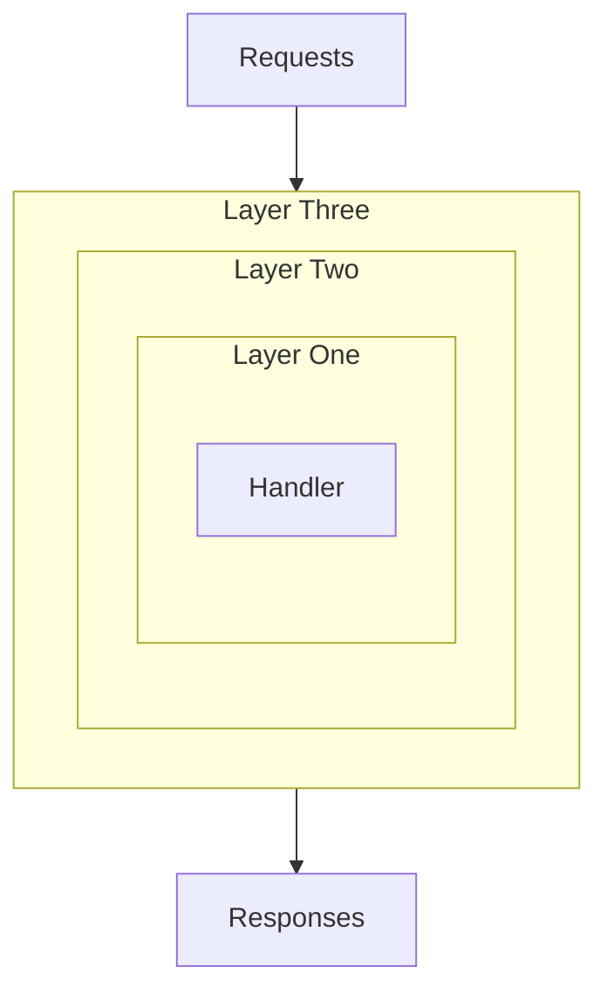

# Middleware

## Intro

Taxum uses Tower-style layers to implement its middleware system. This differs from the more commonly seen approach
in JavaScript frameworks, as layers are always applied after the routes they should apply to, instead of before.

## Applying Middleware

Taxum allows you to add middleware just about anywhere:

- To entire routers with [Router.layer](/api/@taxum/core/routing/classes/Router.html#layer)
  and [Router.routeLayer](/api/@taxum/core/routing/classes/Router.html#routeLayer)
- To method routers with [MethodRouter.layer](/api/@taxum/core/routing/classes/MethodRouter.html#layer)

When middleware is added at any point, Taxum will automatically wrap it with two additional layers:

- A layer which converts any `HttpResponseLike` value into an `HttpResponse`.
- A layer which converts any thrown errors into an `HttpResponse`.

## Ordering

When you add middleware with `Router.layer` (or similar), all previously added routes will be wrapped in the middleware.
Generally speaking, this results in middleware being executed from bottom to top.

So if you do this:

```ts
import { m, Router } from '@taxum/core/routing';

const router = new Router()
    .route("/", m.get(() => "Hello world"))
    .layer(layerOne)
    .layer(layerTwo)
    .layer(layerThree);
```

Think of the middleware as being layered like an onion where each new layer wraps all previous layers:



That is:

- First `layerThree` receives the request.
- It then does its thing and passes the request onto `layerTwo`.
- Which passes the request onto `layerOne`.
- Which passes the request onto the handler where a response is produced.
- That response is then passed to `layerOne`.
- Then to `layerTwo`.
- And finally to `layerThree` where it's returned out of your app.

It's a little more complicated in practice because any middleware is free to return early and not call the next layer,
for example, if a request cannot be authorized, but it's a useful mental model to have.

## Writing Middleware

Taxum offers many ways of writing middleware, at different levels of abstraction and with different pros and cons.

### `@taxum/core/routing/serviceLayerFn`

This is the simplest and most familiar way of writing middleware. You pass in a function which receives the request and
the next service in line:

```ts
import { m, Router, serviceLayerFn } from '@taxum/core/routing';

const router = new Router()
    .route("/", m.get(() => "Hello world"))
    .layer(serviceLayerFn(async (req, next) => {
        // Do something with the request
        const res = await next.invoke(req);
        // Do something with the response
        
        return res;
    }));
```

### `@taxum/core/routing/layerFn`

If you have a service written as a class implementing `Service`, you can use `layerFn` to turn it into a layer:

```ts
import type { HttpRequest, HttpResponse } from "@taxum/core/http";
import { layerFn, m, Router, Service } from '@taxum/core/routing';

class MyService implements Service {
    public constructor(private readonly inner: Service) {
    }

    async invoke(req: HttpRequest): Promise<HttpResponse> {
        // Do something with the request
        const res = await next.invoke(req);
        // Do something with the response

        return res;
    }
}

const router = new Router()
    .route("/", m.get(() => "Hello world"))
    .layer(layerFn((inner) => new MyService(inner)));
```

This allows you to have a service defined once and add configuration to it at the point of usage, e.g., when you are
using the middleware in different places.

### `@taxum/core/routing/Layer`

The most complex approach is to write a class implementing `Layer`:

```ts
import type { HttpRequest, HttpResponse } from "@taxum/core/http";
import { layerFn, m, Layer, Router, Service } from '@taxum/core/routing';

class MyService implements Service {
    public constructor(private readonly inner: Service) {
    }

    async invoke(req: HttpRequest): Promise<HttpResponse> {
        // Do something with the request
        const res = await next.invoke(req);
        // Do something with the response

        return res;
    }
}

class MyLayer implements Layer {
    public layer(inner: Service): Service {
        return new MyService(inner);
    }
}

const router = new Router()
    .route("/", m.get(() => "Hello world"))
    .layer(new MyLayer());
```

By defining your own layer class, you can add logic to the creation of the service while also accepting configuration
at the point of usage.
